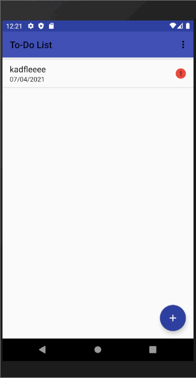

Firstly, in order to add an item user must select the add option on the right side  so that the products can be added.After adding the product user can update or delete any product whenever user find it necessarily.

# todoactivity

